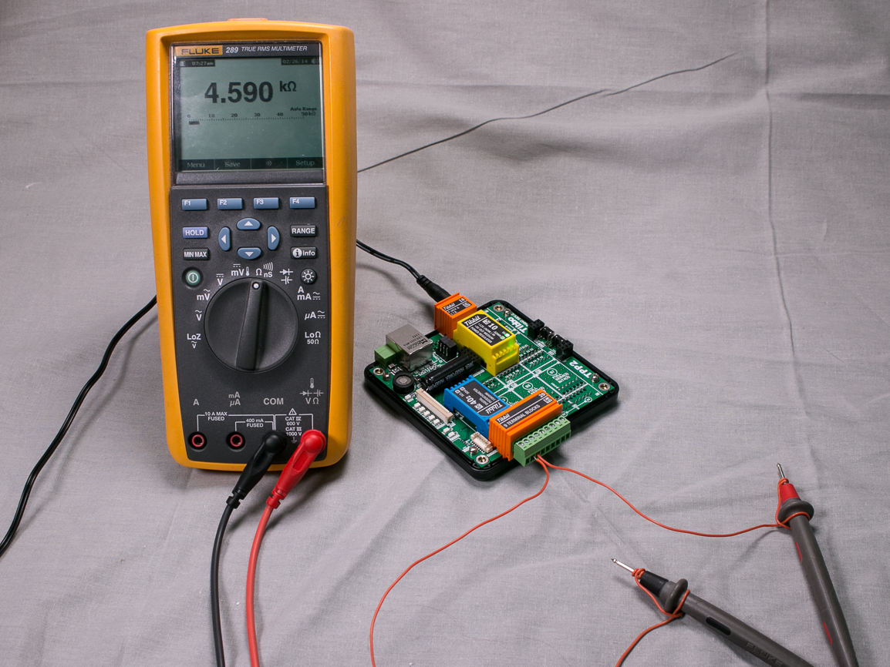

# Test Application for Digital Potentiometer Tibbits (#40-x)

You will need:

- TPP2, TPP2(G2), TPP3, or TPP3(G2) board
- At least one #40-1, #40-2, #40-3, or #40-4 Tibbit
- One Tibbit #20 (9 terminal blocks)
- Optionally, one Tibbit #9 or #10 (12V->5V regulator)
- Optionally, one Tibbit #18 (power jack)

*The last two Tibbits are necessary if you are going to power your rig from a 12V power adaptor. Alternatively you can supply regulated +5V power directly to the TPP.*

This Tibbit is based on the MCP4561 digital POT IC from Microchip. Tibbo supplies the Tibbit in 5KOhm, 10KOhm, 50KOhm, and 100KOhm versions.

The test application is meant to be executed in debug mode. We've placed breakpoints on lines where you need to stop and observe the result.

The application tests the digital POT in three steps:

First, you will break after executing **tbt40_set(256,NO)**. This sets the POT to the maximum value it can produce. You will observe this value between pins 3 and 4 of Tibbit #40 (terminal blocks 2 and 3 on Tibbit #20).

The actual impedance value will differ from the nominal one. For example, you may get 4.6KOhm out of the 5KOhm Tibbit. The variation of +/-10% is to be expected.

Once you know the actual range of your Tibbit, exit the debug mode and set the **FULL_SCALE** constant to this value (for example, **FULL_SCALE=4600**). Now run the program again. Press F5 until you stop past the **tbt40_set_ohm(FULL_SCALE/2,FULL_SCALE,YES)** line. Executing it will set the POT to 1/2 of its max impedance. Since the **FULL_SCALE** constant is already adjusted to reflect the actual range of the IC you are testing the resulting impedance will be quite accurate.

Stopping at the third breakpoint will set the impedance to 1/3 of the max value.

#### Measuring the impedance for Tibbit #40